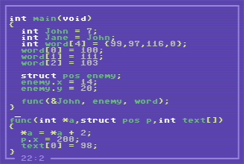

# C64 C-editor
A small editor to write syntax highlighted c-code on the Commodore 64

A 'silly' little project I made for use in the background of one of my videos. An program running on the Commodore 64,
that gives you an editing-environment reminiscent of Borland Turbo C 3.x from the early 1990s.

There is no functionality for actually compiling C-code, and it can't even load or save files, it is only a visual gimmick.

The screen mimics a window with a thin border, and it is possible to scroll up and down through a text longer than 
the 23 lines visible. Any test you write is syntax highlighted, according to some very simple rules.

## Using the editor
*See section ["Running the editor"](#running-the-editor) on how to get it up and running on your own Commodore 64 (or emulator)*

Unlike the Commodore 64's usual full screen editor, you can't move about the entire screen, but only in the lines you have created. When you open the editor, you only have a single line. Press RETURN to make additional lines. Once you have created lines, you can move freely around them - there is no known "end of line", rather every line goes to the edge of the screen.

You can create as many lines as you want (*if you don't want more than 255*) and freely scroll up and down, viewing 23 on the screen at all times.

Use `CURSOR` keys and `HOME` to navigate around the screen
* Cursor `UP` moves the cursor to the previous line (if any) - if at the top of the screen, scrolls the line above into view.
* Cursor `DOWN` moves the cursor to the next line (if any) - if at the bottom of the screen, scrolls the line below into view.
* Cursor `RIGHT` moves the cursor to the right - if at the right edge of the screen, moves to the beginning of the next line.
* Cursor `LEFT` moves the cursor to the left - if at the beginning of the line, moves to the end, _the last non-space character_, of the previous line.
* `HOME` moves the cursor to the beginning of the current line.
  * pressed a second time, moves to the top of the screen.
  * pressed a third time, scrolls the screen, and shows from the first line.

Use `RETURN`, `DEL` and `INST` to manipulate lines

* `RETURN` creates a new line
  * When used at the end of a line (after any text) - creates a new empty line __after__ this.
  * When used at the beginning of a line - creates a new empty line **before** this.
  * When used in the middle of a line, splits the line into two - effectively creating a new line ...
* `DEL` functions as backspace, deleting the character to the left of the cursor, and shifting all remaining characters on that line to the left.
  * When used at the beginning of a line - joins this line with the previous one.
* `INST` inserts a space at the current cursor-position, shifting the remainder of the line to the right.
  * if characters are shifted beyond the edge of the screen, a new line is created below, to shift additional characters into.

Use `C=` (the Commodore-logo key) for special characters
* C= i for curly bracket open **{**
* C= o for curly bracket close **}**

### Editing text
The editor always works in "overwrite" mode, like the usual Commodore 64 fullscreen editor. You need to use `INST` to insert additional spaces before writing the text you want to insert.

### Syntax highlighting
Edited text is continously syntax highlighted according to some very simple rules:

|type|color|description|
|----|----|----|
|Text    |GREEN |words starting with letters, but can include numbers|
|Numbers |GREY  |0,1,2,3,4,5,6,7,8,9 and combinations
|Symbols |YELLOW|!#&%*{},.; and others
|Keywords|WHITE |known keywords like `int`, `char`, `struct`, and `return`|

So far, there is no support for highlighting floating point or hexadecimal numbers correctly

Comments and Strings are planned for future versions, though.

## Running the editor 
You need a Commodore 64 (or an emulator) to run the editor. I recommend the [VICE emulator](https://vice-emu.sourceforge.io/) that is available for most systems. The **c-editor** doesn't use any fancy hacks, it only writes to the VIC once, to select a different charset, so any emulator should be fine.

Download the editor from the [release](/release/)-folder - two versions are available:
* D64 - is a complete disk-image, including the editor as well as the font-file, should you wish to use it for other projects.
* PRG - is a Commodore 64 program that loads as a BASIC program and starts the editor. It includes the font.

The easiest one to use with an emulator is the D64 version - download the file, open VICE (the *x64sc* version) go to the menu and select "Attach disk image" and "drive 8".

In most versions of VICE you can see the contents of the disk-image, and simply double-click on the **"C-EDITOR"** line. That will load the file directly. If you don't have that option, just attach the image, and in the Commodore 64 type:
`LOAD"*",8,1` and press enter.
Once the screen signals READY and a blinking cursor, type `RUN` and press enter.

Now you are in the editor. You can quit it by pressing `RUN/STOP` and `RESTORE`, or simply turning off the emulator.

To run the editor on a real Commodore 64, you have to transfer one of the files to a medium that can be read by the Commodore 64 - you need some hardware to interface the Commodore 64 to modern media. I recommend SD2IEC, pi1541 or Kung-Fu-Flash - the editor is a single file, so will work with any of these!

## "Compiling" the code
The code is written in assembly, but on a modern computer using [KickAssembler](http://theweb.dk/KickAssembler/Main.html#frontpage). I have used a few features specific to KickAssembler, so the code won't immediately work with other cross-assemblers.

I've been using Visual Studio Code with the [Kick Assembler 8-Bit Retro Studio](https://marketplace.visualstudio.com/items?itemName=paulhocker.kick-assembler-vscode-ext) extension. Of the various KickAssembler extensions for VS Code, this one works best and has the most features (and recent updates).

I followed [this guide](https://www.youtube.com/watch?v=MaIV3LFT3zo) to install and setup everything. It is in German, but I think that everyone should be able to follow along. I noted that neither the extension nor KickAssembler accepted filepaths with spaces, so I've put everything in a C64 folder. I also had problems using the existing Java installation, so had to use the OpenJDK suggested.

The code consists of several assembler-files (11 of them) as well as a font-file that is automatically included. The **startup-file** is `main.asm` - you need to add that as **Kickassembler:startup** if you want to be able to build the project when other files are open.

To build (and run) the code from within Visual Studio Code, simply select **Kick Assembler: Build and Run Startup** (F5) or **Kick Assembler: Build and Run** (F6) *(when the main.asm file is open)* from the ctrl+shift+P menu.

## Understanding the code
This is my first multi-file cross-assembler project in a long, long time, so I have been experimenting a bit with how to structure the code best. There's certainly room for improvement!

### Files
The source is split into multiple files, one font-file and a number of assembly-files:

<dl>
<dt><code>c-font.font</code></dt>
<dd>the custom font used in the editor - this is a Commodore 64 file with the first two bytes indicating the starting address ($2000) and the remainder being the data to put into that address.

NB: The file also includes 64 bytes extra for the cursor-sprite (the underscore)</dd>
<dt><code>main.asm</code></dt>
<dd>The main-file that contains the start of the program, and the user-interface-loop.</dd>
<dt><code>constants.asm</code></dt>
<dd>Only includes definitions of constants used in other files, no actual code.</dd>
<dt><code>zeropage.asm</code></dt>
<dd>Includes the dedicated zeropage addresses being used - the program ONLY writes to zeropage, there are no variables in other files.</dd>
<dt><code>screen.asm</code></dt>
<dd>A short list of screen-line-addresses used as a quick look-up table</dd>
<dt><code>memory.asm</code></dt>
<dd>Helper-functions to fill and copy large areas of memory - and the important function to show what's in memory to the screen.</dd>
<dt><code>printing.asm</code></dt>
<dd>Only contains the function to print a new character.</dd>
<dt><code>edit.asm</code></dt>
<dd>Contains the complex functions for newline, insert and delete, as well as helper-functions for shifting subsequent lines up or down (deleting or inserting lines in memory)</dd>
<dt><code>cursor.asm</code></dt>
<dd>Everything related to moving the cursor around, and displaying the cursor as well as the coordinates.</dd>
<dt><code>scrolling.asm</code></dt>
<dd>Functions for scrolling the (entire) screen up or down.</dd>
<dt><code>colors.asm</code></dt>
<dd>Contains all the syntax highlighting code - functions for colorizing the current line, as well as helper functions for re-coloring the first, the last, or every line on the screen.</dd>
<dt><code>status.asm</code></dt>
<dd>Extra functions for displaying the cursor coordinates (as well as optional debug-information) in the border. Made separate to not interfere with the cursor and colors on the "edit-screen".</dd>
</dl>

### Theory of Operation

#### Memory
The editor works entirely in memory - meaning that it only writes and edits text in the memory, and then afterwards displays the result on the screen. Nothing (apart from colors) are ever moved around on the screen.

The memory is set up as an unending list of bytes starting from `MEM_BASE` (currently address $3000) and theoretically going on forever, but limited to 255 lines of 38 characters, meaning that it will end after 9690 bytes (at address $55DA) - however, there's no check for that limit, and the program might crash if it is reached.

Every line (in the memory) is always a full `LINE_LENGTH` (38 characters) no matter if it is empty, contains a single symbol, a few letters, or takes up all the characters.

The number of lines are tracked by the zeropage variable `lines_total` - initially it is 1, and then incremented for every newline created, or decremented for every line removed. Lines are removed by removing all their characters from memory (effectively copying everything from the following line to the end of the document into the removed line (and forward)). New lines are created by inserting a full lines worth of bytes after the current line (effectively copying from the current line to the end of the document into the next line).

Shifting/Copying memory only happens when inserting or deleting lines - since a line's length never changes, characters can be inserted and deleted without affecting memory of other lines.

When editing is completed (in memory) the function `mem_show` can be called to show the updated memory on the screen. The zeropage variable `lines_offset` indicates which line to show as the first on the screen - 0 being `MEM_BASE`, *n* being `MEM_BASE + LINE_LENGTH * n`.

#### Editing

When moving the cursor around the screen, the zeropage variables `xpos` and `ypos` keeps track of the position *in memory*. `ypos` is the line-number (starting from 1) and `xpos` the position on that line (also starting from 1).

To speed up calculations and avoid re-displaying the entire screen for every edit, a number of variables are updated continuously when editing. `mem_line` keeps track of the current line being edited, and `mem_cursor` the exact position in memory when the cursor changes its' x. Similarly `scr_line` and `scr_cursor` keeps track of the current position on the screen, so single characters can be displayed directly (and they are also used to quickly find color addresses).

`lines_offset` is only changed when scrolling, and used to calculate the `scr_line` and `scr_cursor` from `ypos` and `xpos`.

#### Coloring
Everytime a line is edited or scrolled into view, the colors are recalculated for the entire line. 
A simple state machine handles the colorization. It currently has two "modes" `char` and `letter` - it always starts in `char`.

It begins by receiving the next character on the line:

In `char` mode, if the character is a letter (a-z or A-Z), it switches to `letter` mode.
If not it checks for either a symbol or a number, and colorizes the character immediately, before receiving the next character.

In `letter` mode, if the character is a symbol (or space) the mode ends.
If not it adds the character to a buffer - in fact it stores two pointers, `color_start` and `color_end` to point to the first and last character in memory.

If `letter` mode ends, the buffered characters are examined and compared with a list of keywords, one by one. If there is a match, the entire buffer is colored as a keyword in WHITE. If all keywords have been checked, and no match found, the buffer is colored as text in GREEN.

The list of keywords is stored in the program, but can be moved to anywhere. Each keyword is a zero-terminated string, and the list ends with an additional zero.

I hope that you find the program at least a bit entertaining - I thoroughly enjoyed making it. If you have ideas for improvements, especially on how to compact the code or make it perform faster, don't hesitate to contact me.

*Peter*